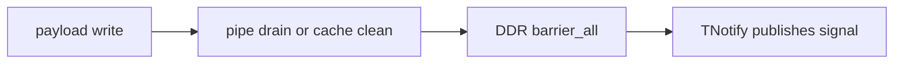
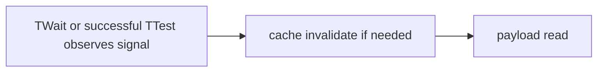

# PTOAS 内存一致性设计

本文说明 PTOAS 如何建模并校验 GM payload 与 signal 之间的内存一致性要求。

这里讨论的是内存一致性，不是自动同步。自动同步负责 pipe 之间的执行顺序，例如
`set_flag`、`wait_flag` 和 `pipe_barrier`。内存一致性负责回答另一个问题：当 signal
已经被对端观察到时，signal 之前发布的 payload 是否已经对正确的观察方可见。

## 1. 背景

`pto.comm.tnotify` 用来发布一个 signal。对端通过 `pto.comm.twait` 或
`pto.comm.ttest` 观察这个 signal，然后读取对应的 payload。

一个容易误解的点是：signal ready 不等价于 payload 一定已经可见。原因是 signal
和 payload 可能走不同的硬件路径：

- signal 通常是一个较小的通信同步标记。
- payload 通常是更大的 GM 数据，可能由 MTE3、TPUT 或 cacheable scalar store 写出。
- 不同路径之间只靠源码顺序不一定形成完整的可见性关系。

因此，PTOAS 需要在发布 signal 前校验 release 侧动作，在消费 signal 后校验
acquire 侧动作。

## 2. 关键概念

### 2.1 Payload

payload 是真正要被对端或后续代码读取的数据。例如：

- `TStore` 写出的 GM 数据。
- `TPUT` 内部写出的 peer GM 数据。
- `store_scalar` 写出的 GM 数据。

### 2.2 Signal

signal 是通知对端 payload 已经准备好的标记。例如：

- `TNotify` 发布 signal。
- `TWait` 等待 signal。
- `TTest` 轮询 signal 是否 ready。

signal 只表达“通知发生了”。如果 signal 前没有正确的 release 动作，signal 可能先被
对端观察到，而 payload 仍然没有进入对端能够正确读取的可见性状态。

### 2.3 Pipe drain

pipe drain 用来保证某条 pipe 上已经发出的工作完成到该 pipe 的边界。典型指令是：

```mlir
pto.barrier #pto.pipe<PIPE_MTE3>
```

它解决的是 pipe 内工作排空问题。它不等价于 cache clean，也不等价于 DDR-domain
visibility fence。

### 2.4 Cache maintenance operation

cache maintenance operation 用来处理 cacheable GM 访问造成的 cache line 状态。
当前 PTOAS 暴露两个语义 op：

```mlir
pto.cmo.clean all #pto.address_space<gm>
pto.cmo.cacheinvalid all #pto.address_space<gm>
```

第一阶段采用 whole-cache 形式。也就是说，它不指定精确地址范围，而是对整个 GM
相关 data cache 做保守处理。这样优先保证正确性，后续再优化成精确 range。

### 2.5 DDR fence

DDR fence 用来把已经完成的 GM 写入或 cache maintenance 操作推进到 DDR visibility
domain，并约束它们发生在后续 signal publish 之前。当前 PTOAS 暴露两个语义 op：

```mlir
pto.fence.barrier_all #pto.fence_scope<ddr>
pto.fence.barrier_all #pto.fence_scope<ddr>
```

当前 release 和 acquire 都使用同一个 `ddr` scope。语义上，release 侧用于发布
payload，acquire 侧用于约束观察 signal 后的 payload 读取。

## 3. 整体模型

生产端的正确顺序是：



消费端的正确顺序是：



这两个方向配合起来，才能保证 signal 和 payload 的顺序关系对观察方成立。

## 4. 显式 IR 接口

PTOAS 选择把 cache maintenance 和 DDR fence 暴露成显式 PTO IR，而不是在 lowering
阶段偷偷插入 `dcci` 和 `dsb`。

原因如下：

- 这类动作有实际运行时成本，尤其 whole-cache CMO 成本较高。
- 用户或 PyPTO 更清楚 payload 的发布边界。
- PTOAS 可以负责校验契约，避免漏插或乱序，而不是猜测所有场景。
- VPTO 后端当前还没有确认的 DSB 和 DCCI intrinsic ABI，显式 IR 可以先稳定上层契约。

当前新增的语义 op 是：

| PTO IR | 语义 | EmitC lowering |
| --- | --- | --- |
| `pto.cmo.clean all #pto.address_space<gm>` | 清理 GM 相关 dirty cache line | `dcci((__gm__ void*)0, ENTIRE_DATA_CACHE, CACHELINE_OUT)` |
| `pto.cmo.cacheinvalid all #pto.address_space<gm>` | 失效 GM 相关 stale cache line | `dcci((__gm__ void*)0, ENTIRE_DATA_CACHE)` |
| `pto.fence.barrier_all #pto.fence_scope<ddr>` | DDR visibility barrier，可用于 publish 或 acquire 边界 | `dsb(DSB_DDR)` |

这里的 `dcci` 是 cache maintenance 指令，不是 pipe drain，也不是 DDR visibility
fence。当前 PTOAS 只暴露 whole-cache 形式：

- `ENTIRE_DATA_CACHE` 表示作用范围是整个 data cache，不指定具体 GM 地址范围。
- `CACHELINE_OUT` 表示 clean/writeback，把 dirty cache line 推出到 memory system。
- 不带 `CACHELINE_OUT` 的 `dcci((__gm__ void*)0, ENTIRE_DATA_CACHE)` 表示 invalidate，
  让后续 cacheable GM load 不再使用本地 stale cache line。

因此 `cmo.clean` 和 `barrier_all` 不能互相替代。`cmo.clean` 负责把本地 dirty cache
line 发起写回；`barrier_all` 负责等待并约束这些写回以及前序 GM write 在 signal 发布前
进入 DDR visibility domain。release 路径上顺序必须是先 `cmo.clean`，再
`barrier_all`，不能调换。

## 5. MemoryConsistency pass

`pto-memory-consistency` 是一个 Module pass，运行在 shared mainline 上，因此 EmitC 和
VPTO backend 都会先经过这一步。

这个 pass 的职责是校验显式契约：

- 识别 signal publish 前是否存在 pending payload write。
- 识别 signal acquire 后是否存在 cacheable GM payload read。
- 校验用户或 PyPTO 是否已经插入必要的 CMO 和 fence。
- 在显式 barrier_all 前自动补齐必要的 MTE3 或 FIX pipe drain。
- 对缺失或顺序错误的场景报编译错误。
- 对不需要 `dcci` 和 `dsb` 的纯 pipe drain 场景，仍允许保留自动标注。

遍历策略是 region-scoped 的保守分析：单 block region 按顺序递归分析；复杂 CFG
region 暂不做 path-sensitive 数据流，但只在当前 region 内收集 pending state，不把同一个
parent op 的其他 sibling region 状态混入。外部函数声明没有函数体，pass 会直接跳过。

`func.call` 边界不做上下文敏感的数据流传播。若 same-module 非内联 callee 的传递调用闭包
中包含 payload 访问、CMO、fence 或 signal 相关 PTO op，pass 会报错并要求在
`pto-memory-consistency` 前完成 inline。这样可以避免 caller 在 `TNotify` 前看不到 callee
内部 pending payload write，或者 callee 内部 cacheable payload read 看不到 caller 侧
`TWait` acquire state。

这个 pass 不负责分配 event id，也不属于 InsertSync 自动同步流水线。

## 6. 场景规则

### 6.1 MTE3、FIX 或 TPUT 写 payload 后发布 signal

适用场景：

- `TStore` 通过 `PIPE_MTE3` 写 GM。
- `TStore` 通过 `PIPE_FIX` 写 GM，例如 ACC tile 写回 GM。
- `TStoreFP` 通过 `PIPE_FIX` 写 GM。
- `TPUT` macro op 内部通过 MTE3 写 peer GM。
- 其他 macro op phase 中存在 MTE3 GM write。

需要的顺序：

```mlir
// payload producer
pto.fence.barrier_all #pto.fence_scope<ddr>
pto.comm.tnotify ...
```

PyPTO 或用户只需要表达 `pto.fence.barrier_all` 这个内存一致性边界。PTOAS 会在
`pto.fence.barrier_all #pto.fence_scope<ddr>` 前检查是否存在 pending MTE3 或 FIX GM write；如果存在，
自动插入对应 pipe 的 drain：

```mlir
pto.barrier #pto.pipe<PIPE_MTE3>
// or
pto.barrier #pto.pipe<PIPE_FIX>
```

最终 lowering 的顺序是：

```cpp
pipe_barrier(PIPE_MTE3);
dsb(DSB_DDR);
pto::comm::TNOTIFY(...);
```

`pipe_barrier(PIPE_MTE3)` 或 `pipe_barrier(PIPE_FIX)` 用来排空实际执行 GM write 的
pipe。`pto.fence.barrier_all` lower 出来的 `dsb(DSB_DDR)` 用来保证这些 GM 写入在 signal
发布前进入 DDR visibility domain。

这里不能把所有 `PIPE_FIX` op 都当成 release payload write。很多 FIX op 只是本地
ACC 到 MAT 或 ACC 到 VEC 的搬运，不需要 DDR release。PTOAS 只对确认写 GM payload 的
FIX 路径补 release drain。

同理，也不能把所有 `PIPE_MTE3` op 都当成 release payload write。例如 A5 的
Vec 到 Mat `TInsert` 是本地 UB 到 L1 的搬运，不发布 GM payload。PTOAS 只对
`TStore`、comm macro MTE3 phase 等确认写 GM payload 的路径补 release drain。

如果缺少 `pto.fence.barrier_all`，PTOAS 会报错。因为 PTOAS 可以推导 pipe drain，但不会凭空
猜测 payload publish 的语义边界。

### 6.2 MTE2 工作后发布 signal

适用场景：

- `TLoad` 或其他 `PIPE_MTE2` 工作出现在 `TNotify` 之前。

当前规则：

```mlir
// PTOAS 可以自动标注并在 EmitC lowering 中生成 PIPE_MTE2 barrier
pto.comm.tnotify ...
```

MTE2 是 GM read 方向。它需要的是 signal 前不要越过前序 MTE2 工作，但不需要 DDR
barrier_all。PTOAS 当前仍允许自动插入这类纯 pipe drain。

### 6.3 Cacheable scalar GM store 后发布 signal

适用场景：

- `store_scalar` 写 GM，并且该路径可能经过 cache。

需要的顺序：

```mlir
pto.store_scalar ...
pto.cmo.clean all #pto.address_space<gm>
pto.fence.barrier_all #pto.fence_scope<ddr>
pto.comm.tnotify ...
```

`pto.cmo.clean` 把 dirty cache line 推出。`pto.fence.barrier_all` 等待并约束 clean 的结果在
signal 发布前可见。

如果只插 `pto.fence.barrier_all`，PTOAS 会报错。因为 fence 不会替代 cache clean。

### 6.4 TWait 或 TTest 后读取 cacheable GM payload

适用场景：

- `TWait` 返回后执行 `load_scalar` 读取 GM payload。
- `TTest` 成功观察到 signal 后执行 `load_scalar` 读取 GM payload。

需要的顺序：

```mlir
pto.comm.twait ...
pto.cmo.cacheinvalid all #pto.address_space<gm>
%value = pto.load_scalar ...
```

invalidate 用来避免读取到本地 stale cache line。

### 6.5 Acquire 前本地可能存在 dirty GM cache

适用场景：

- 同一个执行流中，等待 signal 前已经有 cacheable GM store。
- 后续又要在 signal acquire 后读取 GM payload。

需要的顺序：

```mlir
pto.store_scalar ...
pto.cmo.clean all #pto.address_space<gm>
pto.fence.barrier_all #pto.fence_scope<ddr>
pto.comm.twait ...
pto.cmo.cacheinvalid all #pto.address_space<gm>
%value = pto.load_scalar ...
```

clean 和 barrier_all 用来处理本地 dirty cache。invalidate 用来处理 signal 后读取对端
payload 时可能遇到的 stale cache。

## 7. PyPTO 对接说明

PyPTO 对接时需要区分两个层次：

- PyPTO 负责表达语义：哪里发布 payload，哪里观察 signal 后消费 payload，哪里需要 GM
  cache clean 或 invalidate。
- PTOAS 负责实现语义：校验这些边界是否完整，把语义 IR lower 到目标 backend，并在
  barrier_all 前自动补齐本地 pipe drain。

也就是说，PyPTO 不应该直接生成底层 `pipe_barrier`、`dsb` 或 `dcci`。这些是 backend
action，不是 PyPTO 和 PTOAS 之间的稳定接口。PyPTO 应该生成 PTOAS 提供的显式内存一致性
IR。

### 7.1 为什么 PyPTO 需要生成这些 IR

通信程序通常有两个对象：

- payload：真正要被对端或后续代码读取的 GM 数据。
- signal：告诉对端 payload 已经准备好的同步标记。

例如 producer 先写 `payload_gm`，再执行 `TNotify`；consumer 通过 `TWait` 或 `TTest`
看到 signal ready 后，再读取 `payload_gm`。这里有一个关键点：signal ready 不自动等价于
payload 已经对 consumer 可见。原因是 signal 和 payload 可能走不同硬件路径，普通
pipe 同步只能描述本地 pipe 执行顺序，不能完整表达 GM 可见性和 cache maintenance。

因此 PyPTO 需要在 payload publish 和 signal acquire 边界显式生成 CMO 和 fence。PTOAS
会检查这些 IR 是否满足内存一致性要求。

### 7.2 PTOAS 提供给 PyPTO 的语义 IR

当前 PR 暴露 3 个 memory consistency IR。它们都没有 SSA operand 和 result；参数通过
PTO attr 表达。PyPTO 可以直接传 enum，binding 会自动构造对应 attr。

| IR | 参数 | 当前支持取值 | MLIR 写法 | PyPTO 写法 |
| --- | --- | --- | --- | --- |
| `pto.fence.barrier_all` | `scope: FenceScopeAttr` | `ddr` | `pto.fence.barrier_all #pto.fence_scope<ddr>` | `pto.FenceBarrierAllOp(pto.FenceScope.DDR)` |
| `pto.cmo.clean` | `space: AddressSpaceAttr`，粒度固定为 `all` | `gm` | `pto.cmo.clean all #pto.address_space<gm>` | `pto.CmoCleanOp(pto.AddressSpace.GM)` |
| `pto.cmo.cacheinvalid` | `space: AddressSpaceAttr`，粒度固定为 `all` | `gm` | `pto.cmo.cacheinvalid all #pto.address_space<gm>` | `pto.CmoCacheInvalidOp(pto.AddressSpace.GM)` |

这里的 `all` 是当前 CMO op assembly format 的固定关键字，表示 whole-cache 粒度。第一阶段
不传 GM 地址和范围，后续如果支持精确 range CMO，会扩展新的参数或新 op 形式。

`FenceScopeAttr` 当前只定义 `ddr`。`AddressSpaceAttr` 在 PTO dialect 中还有其他地址空间，
但 memory consistency CMO 当前只支持 `gm`。

`pto.fence.barrier_all #pto.fence_scope<ddr>` 表示 DDR visibility barrier。它用于发布
signal 前，要求前序 payload GM write 已经进入 DDR visibility domain；也可以用于观察
signal 后，建立后续 payload 读取的 acquire 边界。具体语义由它在 signal/payload 序列中的
位置决定。

Python binding 写法：

```python
pto.FenceBarrierAllOp(pto.FenceScope.DDR)
```

`pto.cmo.clean all #pto.address_space<gm>` 表示清理 GM 相关 dirty cache line。它用于
cacheable GM store 后发布 signal 的场景，使 barrier_all 能等待并约束 clean 结果可见。

Python binding 写法：

```python
pto.CmoCleanOp(pto.AddressSpace.GM)
```

`pto.cmo.cacheinvalid all #pto.address_space<gm>` 表示失效 GM 相关 stale cache line。它用于
观察 signal 后读取 cacheable GM payload 的场景，避免本地 cache 中的旧值被读取。

Python binding 写法：

```python
pto.CmoCacheInvalidOp(pto.AddressSpace.GM)
```

这些 Python API 支持直接传 enum，不需要 PyPTO 显式传 MLIR `ctx`。binding 会把 enum
自动构造成对应的 PTO attr。

### 7.3 生成规则

PyPTO 不需要手动生成 `pto.barrier #pto.pipe<PIPE_MTE3>` 或
`pto.barrier #pto.pipe<PIPE_FIX>`。这是低层 pipe drain 细节，由 PTOAS 根据 barrier_all
前的 pending GM write pipe 自动插入。这样可以保证最终顺序是对应 pipe barrier 先于
`dsb(DSB_DDR)`，不会出现先 fence、后 drain 的错误顺序。

PyPTO 生成规则可以按下面的表实现：

| 场景 | PyPTO 需要生成 | PTOAS 自动补齐 |
| --- | --- | --- |
| `TStore`、`TStoreFP` 或 `TPUT` 后发布 signal | `pto.fence.barrier_all #pto.fence_scope<ddr>` | `PIPE_MTE3` 或 `PIPE_FIX` drain |
| cacheable scalar GM store 后发布 signal | `pto.cmo.clean all #pto.address_space<gm>`，然后 `pto.fence.barrier_all #pto.fence_scope<ddr>` | 无 pipe drain，除非前面还有 pending MTE3/FIX write |
| `TLoad` 后发布 signal | 不需要显式 fence | `PIPE_MTE2` drain |
| `TWait` 后读取 cacheable scalar GM payload | `pto.cmo.cacheinvalid all #pto.address_space<gm>` | 无 |
| `TTest` ready path 后读取 cacheable scalar GM payload | 在 ready path 的 payload load 前生成 `pto.cmo.cacheinvalid all #pto.address_space<gm>` | 无 |

`pto.entry` launcher 可以调用多个 kernel 函数；每个 kernel 函数会被
`pto-memory-consistency` 独立分析。kernel body 内部若通过 `func.call` 调用包含 payload
访问、CMO、fence 或 signal op 的 helper，PyPTO 应在 `pto-memory-consistency` 前将 helper
inline，或者把 payload、CMO、fence 和 signal 保持在同一个 caller 中。否则 pass 会报错，
避免 caller 侧 `TNotify` 或 `TWait` 看不到 callee 内部的 memory-consistency 状态。

### 7.4 Issue #872：TPUT 发布 signal

```mlir
pto.comm.tput ...
pto.fence.barrier_all #pto.fence_scope<ddr>
pto.comm.tnotify ...
```

对应 PyPTO 写法：

```python
pto.TPutOp(...)
pto.FenceBarrierAllOp(pto.FenceScope.DDR)
pto.TNotifyOp(...)
```

这个形态对应 #872 中的 `TPUT -> TNotify` 问题。`TPUT` macro op 内部会通过
MTE3 写 peer GM payload；如果直接发布 `TNotify`，receiver 可能先观察到 signal ready，
但 payload 写入还没有完成 pipe drain 或进入 DDR visibility domain。

PyPTO 只需要在 `TPUT` 和 `TNotify` 之间插入 `pto.fence.barrier_all`。PTOAS 会识别
`TPUT` macro model 中的 MTE3 GM write phase，并在 `barrier_all` 前自动补齐低层 pipe
drain：

```mlir
pto.comm.tput ...
pto.barrier #pto.pipe<PIPE_MTE3>
pto.fence.barrier_all #pto.fence_scope<ddr>
pto.comm.tnotify ...
```

EmitC 最终生成的关键顺序是：

```cpp
TPUT(...);
pipe_barrier(PIPE_MTE3);
dsb(DSB_DDR);
TNOTIFY(...);
```

如果缺少 `pto.fence.barrier_all`，`pto-memory-consistency` 会报错，而不是静默生成
不满足 publish 语义的代码。这样可以保证 issue 中的 signal 发布一定发生在 peer payload
写入完成并对 DDR visibility domain 可见之后。

### 7.5 TStore 发布 signal

```mlir
pto.tstore ...
pto.fence.barrier_all #pto.fence_scope<ddr>
pto.comm.tnotify ...
```

对应 PyPTO 写法：

```python
pto.TStoreOp(...)
pto.FenceBarrierAllOp(pto.FenceScope.DDR)
pto.TNotifyOp(...)
```

### 7.6 Scalar store 发布 signal

```mlir
pto.store_scalar ...
pto.cmo.clean all #pto.address_space<gm>
pto.fence.barrier_all #pto.fence_scope<ddr>
pto.comm.tnotify ...
```

对应 PyPTO 写法：

```python
pto.StoreScalarOp(...)
pto.CmoCleanOp(pto.AddressSpace.GM)
pto.FenceBarrierAllOp(pto.FenceScope.DDR)
pto.TNotifyOp(...)
```

### 7.7 TWait 后读取 scalar payload

```mlir
pto.comm.twait ...
pto.cmo.cacheinvalid all #pto.address_space<gm>
%value = pto.load_scalar ...
```

对应 PyPTO 写法：

```python
pto.TWaitOp(...)
pto.CmoCacheInvalidOp(pto.AddressSpace.GM)
pto.LoadScalarOp(...)
```

### 7.8 TTest polling 后读取 scalar payload

```mlir
%ready = pto.comm.ttest ...
scf.if %ready {
  pto.cmo.cacheinvalid all #pto.address_space<gm>
  %value = pto.load_scalar ...
}
```

对应 PyPTO 写法：

```python
ready = pto.TTestOp(...)
with scf.IfOp(ready.result):
    pto.CmoCacheInvalidOp(pto.AddressSpace.GM)
    pto.LoadScalarOp(...)
```

如果 PyPTO 使用 `pto.ldg` 或 `pto.stg` 并显式选择 uncache 路径，可以避免部分
cacheable scalar GM 问题。但这不是 `pto.cmo.clean` 或 `pto.cmo.cacheinvalid` 的替代品。
如果之前已经存在 dirty 或 stale cache line，仍需要显式 CMO。

## 8. Backend lowering 状态

### 8.1 EmitC

EmitC backend 已经支持真实 lowering：

- `pto.cmo.clean` lower 到 `dcci(..., CACHELINE_OUT)`。
- `pto.cmo.cacheinvalid` lower 到 `dcci(...)`。
- `pto.fence.barrier_all` lower 到 `dsb(DSB_DDR)`。

### 8.2 VPTO

VPTO backend 当前没有确认的 DSB 和 DCCI intrinsic ABI。

因此，VPTO lowering 中现在提供的是 fail-fast stub：

- `pto.cmo.clean`
- `pto.cmo.cacheinvalid`
- `pto.fence.barrier_all`

如果这些 op 进入 VPTO LLVM lowering，PTOAS 会报错，提示 VPTO backend 尚不支持这些
memory-consistency op，需要确认 DSB/DCCI intrinsic ABI 后再接真实 lowering。

这样做的目的不是支持 VPTO 运行，而是避免 unsupported op 静默残留到后端 IR。

## 9. 当前限制

当前实现优先保证正确性，仍有以下限制：

- CMO 是 whole-cache 粒度，不是精确地址范围。
- `TWait` 和 `TTest` acquire 侧当前只覆盖 `load_scalar`。
- VPTO 暂不支持 CMO 和 DDR fence 的真实 lowering。
- 对复杂 CFG 的分析仍是保守近似，不做完整 path-sensitive 数据流。
- MemoryConsistency pass 校验的是显式内存一致性契约，不替代 InsertSync 的 alias 和 pipe
  同步分析。

## 10. 后续工作

后续可以分几步推进：

1. 和 VPTO/Bisheng 对齐 DSB 和 DCCI intrinsic ABI，并补齐 VPTO lowering。
2. 将 whole-cache CMO 优化成精确 GM address range CMO。
3. 扩展 acquire 侧 consumer 范围，从 `load_scalar` 扩展到更多 cacheable GM read。
4. 将 macro op phase 的 memory descriptor 做得更精细，减少误报。
5. 在 PyPTO 和 PTOAS 之间明确 cacheable 与 uncacheable GM 访问的 IR 契约。
